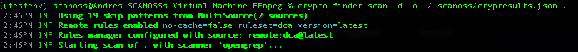
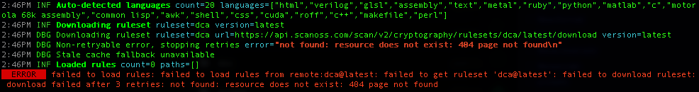
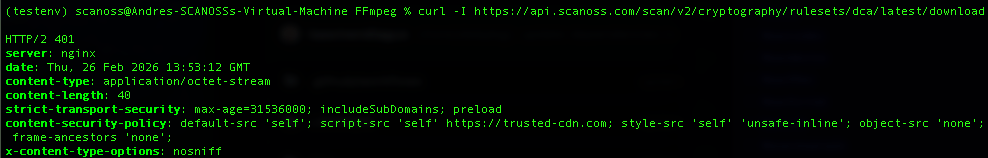
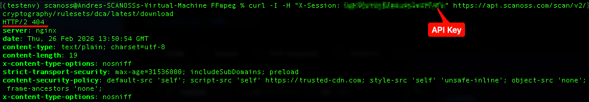

# Documentation Audit: Crypto Finder
**Reviewer:** Andrés Ibarra (Lead Technical Engineer)
**Status:** Verification Pending (Permission Issue)

## 1. Validation Status: Blocked
During the technical audit of the [Crypto Finder Getting Started](https://scanoss.mintlify.app/en/latest/crypto-finder/getting-started/overview) guide, I was unable to fully verify the accuracy of the scanning results and the effectiveness of the documentation.

**Issue Identified:**
The scanning process fails during the ruleset download phase. Specifically, the engine returns a **404 Not Found** error when attempting to fetch the `dca@latest` ruleset.

**Technical Root Cause:**
After performing a manual `curl` diagnostic to the API endpoint:

* **Without API Key:** Returns `401 Unauthorized`.

* **With Current API Key:** Returns `404 Not Found`.

**Conclusion:**
This indicates that the API endpoint is reachable, but the current API Key lacks the necessary permissions or "Premium Dataset" entitlements to access Cryptography resources. 

## 2. Recommendations for the Documentation Team
Once the permission issue is resolved, I suggest adding a **"Pre-flight Access Check"** section to the guide. This would help users identify if their API Key is correctly provisioned for Crypto scanning *before* they attempt to run a large-scale audit, preventing the "resource does not exist" confusion.

---
*Note: I will resume the full validation of the flags and output examples as soon as the account permissions are checked.*