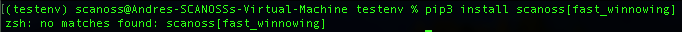
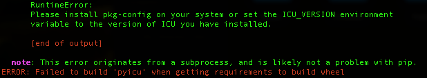
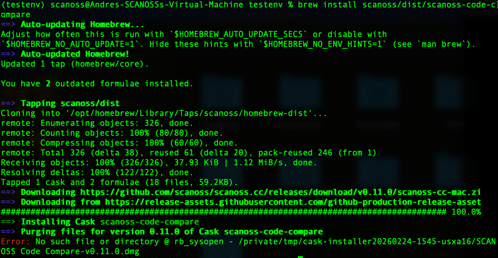

# Documentation Audit: Product & Technical Guides
**Reviewer:** Andrés Ibarra (Lead Technical Engineer)
**Scope:** Installation Fixes, OS-Specific Troubleshooting, and AI-Search Optimization.

## 1. Installation & Prerequisites Strategy
We should move away from redirecting users to external GitHub READMEs for core installation steps. 
**Recommendation:** Implement a **"Global Environment Setup"** page or embed steps directly. This ensures users have Python 3.x, Pip, and essential build headers ready *before* running any scanoss commands.

## 2. CLI Help & Command Scoping
Users often confuse global flags with engine-specific options. 
* Global help: `scanoss-py --help`
* Command-specific help: `scanoss-py scan -h`
**Recommendation:** Add a "CLI Cheat Sheet" to help users distinguish between global methods and specific scanning flags (like `--identify`).

## 3. Critical Fix: Fast Winnowing
In the section [Fast Winnowing Installation](https://scanoss.mintlify.app/en/latest/cli/scanoss-py/installation#fast-winnowing), the documented command is incorrect and leads to installation failures.

* **Incorrect:** `pip3 install scanoss[fast_winnowing]`
* **Correct:** `pip3 install scanoss_winnowing`



## 4. Troubleshooting: Dependency Scanning (Scancode-Toolkit)
In the section [Dependency Scanning](https://scanoss.mintlify.app/en/latest/cli/scanoss-py/installation#dependency-scanning), we must address build failures for `pyicu`.

### Linux (Ubuntu 25.x)
**Steps:**
1. `sudo apt update && sudo apt install -y build-essential python3-dev libicu-dev pkg-config libxml2-dev libxslt1-dev bzip2 zlib1g-dev`
2. `pip install --upgrade pip setuptools wheel`
3. `pip install scancode-toolkit`

### macOS (Sonoma)



**Steps:**
1. `brew install icu4c pkg-config`
2. **Export paths:**
   ```bash
   export PATH="/opt/homebrew/opt/icu4c/bin:/opt/homebrew/opt/icu4c/sbin:$PATH"
   export LDFLAGS="-L/opt/homebrew/opt/icu4c/lib"
   export CPPFLAGS="-I/opt/homebrew/opt/icu4c/include"
   export PKG_CONFIG_PATH="/opt/homebrew/opt/icu4c/lib/pkgconfig"

## 5. SCANOSS Code-Compare (macOS Sonoma)
Based on the [Code Compare Integration](https://scanoss.mintlify.app/en/latest/poc/license-dataset/snippet-detection/scanoss-cc) and its [GitHub Source](https://github.com/scanoss/scanoss.cc#homebrew), we identified an installation failure on macOS.

**Issue:** The Homebrew installation command (`brew install ...`) fails with a `no such file or directory` error during the linking process. 



**Status:** While the `.dmg` file downloads correctly, the automated brew formula is currently broken maybe just for this OS version. 
**Recommendation:** Update the documentation to prioritize manual `.dmg` installation for Sonoma users until the formula is patched.

## 6. AI-Powered Search Optimization (Mintlify Chat)
The Mintlify documentation platform includes an AI-powered chat/search feature. We should actively encourage users to leverage this tool to reduce basic support tickets.

**Recommendations:**
* **Promote AI Chat Usage:** Add a call-to-action or a "Pro Tip" encouraging users to ask the AI assistant for quick troubleshooting.
* **Include Useful Examples:** Populate the documentation with conversational examples that the AI can use to train its responses, such as:
    * *"How do I scan a specific directory while ignoring node_modules?"*
    * *"How can I export my results directly to an SPDX format using the CLI?"*
* **Contextual Training:** Ensure common "Troubleshooting" scenarios (like the ones identified in this audit) are indexed so the AI can provide immediate fixes.